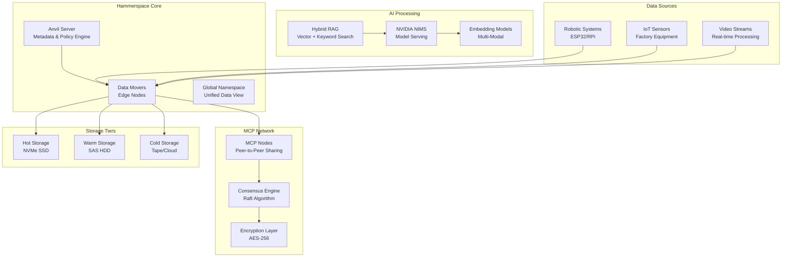
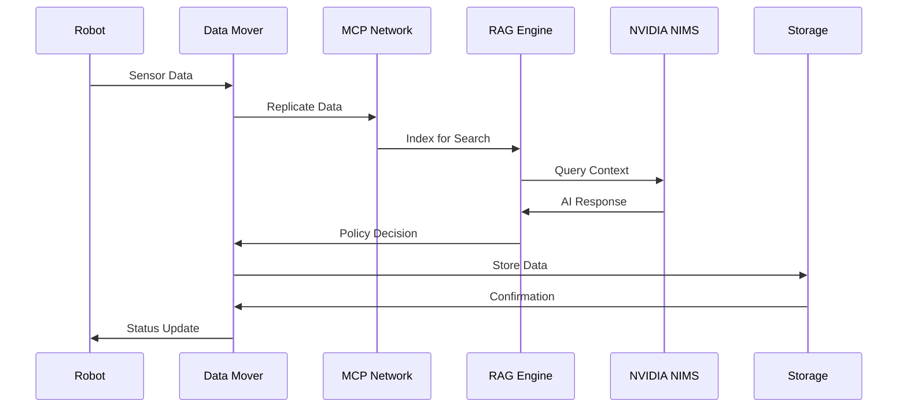

# Hammerspace Integration PRD: Isaac-Nexus Data Orchestration Platform

## Document Information
- **Document Type**: Product Requirements Document (PRD)
- **Product**: Hammerspace Data Orchestration for Isaac-Nexus
- **Version**: 1.0
- **Date**: January 2024
- **Author**: Isaac-Nexus Product Team

## 1. Executive Summary

### 1.1 Product Vision
Transform Isaac-Nexus into a globally distributed, AI-powered robotics system through intelligent data orchestration that seamlessly moves data between edge devices (robots in remote factories) and central processing hubs, with intelligent data placement based on policy-driven automation.

### 1.2 Key Objectives
- Enable seamless data movement between geodistributed robotic systems
- Implement MCP (Model Context Protocol) for agent-based tool calling and fleet control
- Integrate hybrid RAG (Retrieval-Augmented Generation) for AI-driven data processing
- Leverage NVIDIA NIMS (NVIDIA Inference Microservices) for optimized AI inference
- Provide policy-based data orchestration for industrial robotics workflows

### 1.3 Success Metrics
- 99.9% data availability across distributed locations
- <100ms data access latency for hot data
- 40% reduction in data storage costs through intelligent tiering
- 95% automation of data movement decisions
- 99.5% data integrity across replication

## 2. Market Requirements

### 2.1 Market Opportunity
- **Total Addressable Market**: $12B (Industrial IoT Data Management)
- **Serviceable Addressable Market**: $3.2B (Robotics Data Orchestration)
- **Target Market**: $800M (AI-Powered Industrial Robotics)

### 2.2 Customer Segments
1. **Primary**: Manufacturing companies with distributed facilities
2. **Secondary**: Oil & gas companies with remote operations
3. **Tertiary**: Defense contractors with multi-site operations

### 2.3 Competitive Landscape
- **Direct Competitors**: NetApp, Pure Storage, Dell EMC
- **Indirect Competitors**: AWS DataSync, Azure Data Factory
- **Differentiation**: AI-driven policy automation, robotics-specific optimization

## 3. Product Requirements

### 3.1 Core Features

#### 3.1.1 MCP Integration Engine
**Priority**: P0 (Critical)

**Requirements**:
- Implement MCP protocol for peer-to-peer data sharing between robotic systems
- Support distributed consensus algorithms for data consistency
- Enable secure data transmission with end-to-end encryption
- Provide automatic peer discovery and network formation
- Support data sharding and replication across MCP nodes

**Acceptance Criteria**:
- MCP nodes can discover and connect to each other within 30 seconds
- Data replication achieves 99.9% consistency across all nodes
- Encryption overhead is <5% of data transfer time
- Network can handle 1000+ concurrent MCP connections

**Technical Specifications**:
```yaml
mcp_integration:
  protocol_version: "2.1"
  consensus_algorithm: "raft"
  encryption: "AES-256-GCM"
  peer_discovery: "mDNS + DHT"
  max_peers_per_node: 50
  replication_factor: 3
  data_sharding: "consistent_hashing"
```

#### 3.1.2 Hybrid RAG System
**Priority**: P0 (Critical)

**Requirements**:
- Implement hybrid RAG combining vector search with traditional database queries
- Support multiple embedding models (OpenAI, Cohere, local models)
- Enable real-time knowledge retrieval for robotic decision-making
- Provide context-aware data recommendations
- Support multi-modal data (text, images, sensor data)

**Acceptance Criteria**:
- Query response time <200ms for 95% of requests
- Retrieval accuracy >90% for relevant context
- Support for 1M+ documents in knowledge base
- Real-time indexing of new data within 5 seconds

**Technical Specifications**:
```yaml
hybrid_rag:
  vector_database: "Pinecone/Weaviate"
  embedding_models:
    - "text-embedding-ada-002"
    - "cohere-embed-english-v2.0"
    - "sentence-transformers/all-MiniLM-L6-v2"
  hybrid_search:
    vector_weight: 0.7
    keyword_weight: 0.3
  context_window: 4000
  max_retrieval_docs: 10
```

#### 3.1.3 NVIDIA NIMS Integration
**Priority**: P0 (Critical)

**Requirements**:
- Integrate NVIDIA NIMS for optimized AI inference
- Support multiple AI models (LLMs, vision models, robotics models)
- Enable dynamic model loading and scaling
- Provide GPU resource optimization
- Support model versioning and A/B testing

**Acceptance Criteria**:
- Model inference latency <50ms for 95% of requests
- GPU utilization >80% during peak loads
- Support for concurrent model serving
- Automatic failover between model versions

**Technical Specifications**:
```yaml
nims_integration:
  models:
    - name: "llama-2-7b-chat"
      framework: "triton"
      gpu_memory: "8GB"
    - name: "yolov8n"
      framework: "tensorrt"
      gpu_memory: "2GB"
    - name: "isaac-groot"
      framework: "triton"
      gpu_memory: "16GB"
  scaling:
    min_replicas: 1
    max_replicas: 10
    target_utilization: 80
```

#### 3.1.4 Policy-Driven Data Orchestration
**Priority**: P1 (High)

**Requirements**:
- Implement intelligent data movement policies
- Support geofencing for location-aware storage
- Enable time-based data lifecycle management
- Provide cost optimization through intelligent tiering
- Support compliance and governance policies

**Acceptance Criteria**:
- Policy evaluation time <10ms per file
- 95% of data movements follow automated policies
- Cost reduction of 30% through intelligent tiering
- Compliance reporting accuracy of 99.9%

**Technical Specifications**:
```yaml
policy_engine:
  policy_types:
    - "geofencing"
    - "time_based"
    - "access_pattern"
    - "cost_optimization"
    - "compliance"
  evaluation_engine: "drools"
  policy_language: "yaml"
  max_policies: 1000
  evaluation_frequency: "real_time"
```

### 3.2 Advanced Features

#### 3.2.1 Real-Time Data Streaming
**Priority**: P1 (High)

**Requirements**:
- Support real-time data streaming from robotic sensors
- Implement data compression and deduplication
- Provide quality of service (QoS) guarantees
- Enable data transformation and enrichment
- Support multiple streaming protocols (Kafka, MQTT, WebSocket)

**Acceptance Criteria**:
- Stream latency <100ms end-to-end
- Support for 10,000+ concurrent streams
- Data compression ratio >5:1
- 99.9% message delivery guarantee

#### 3.2.2 AI-Driven Data Analytics
**Priority**: P2 (Medium)

**Requirements**:
- Implement predictive analytics for data access patterns
- Provide anomaly detection for data quality
- Enable automated data classification and tagging
- Support real-time data visualization
- Provide insights for system optimization

**Acceptance Criteria**:
- Prediction accuracy >85% for access patterns
- Anomaly detection with <1% false positive rate
- Automated tagging accuracy >90%
- Real-time dashboard updates within 1 second

### 3.3 Integration Requirements

#### 3.3.1 ROS 2 Integration
**Requirements**:
- Provide ROS 2 nodes for data publishing/subscribing
- Support ROS 2 message types and services
- Enable seamless integration with existing ROS 2 workflows
- Provide data synchronization across ROS 2 networks

#### 3.3.2 SCADA Integration
**Requirements**:
- Support OPC UA for industrial communication
- Provide MQTT bridge for telemetry data
- Enable real-time monitoring and control
- Support historical data archiving

#### 3.3.3 Cloud Integration
**Requirements**:
- Support AWS, Azure, and GCP storage services
- Enable hybrid cloud data management
- Provide cloud-native security and compliance
- Support multi-cloud disaster recovery

## 4. Technical Architecture

### 4.1 System Components



### 4.2 Data Flow Architecture



## 5. Performance Requirements

### 5.1 Scalability
- **Data Volume**: Support 100TB+ per location
- **Concurrent Users**: 10,000+ simultaneous connections
- **Geographic Distribution**: 50+ locations worldwide
- **Data Throughput**: 10GB/s aggregate bandwidth

### 5.2 Reliability
- **Availability**: 99.9% uptime SLA
- **Data Durability**: 99.999999999% (11 9's)
- **Recovery Time**: <4 hours for full system recovery
- **Backup Frequency**: Continuous replication + daily snapshots

### 5.3 Security
- **Encryption**: AES-256 at rest and in transit
- **Authentication**: Multi-factor authentication
- **Authorization**: Role-based access control (RBAC)
- **Audit**: Complete audit trail for all operations

## 6. Implementation Roadmap

### 6.1 Phase 1: Foundation (Months 1-3)
- **Week 1-4**: MCP protocol implementation
- **Week 5-8**: Basic Hammerspace integration
- **Week 9-12**: Hybrid RAG system development

**Deliverables**:
- MCP node implementation
- Basic data movement policies
- Vector database integration
- Initial AI model serving

### 6.2 Phase 2: AI Integration (Months 4-6)
- **Week 13-16**: NVIDIA NIMS integration
- **Week 17-20**: Advanced RAG capabilities
- **Week 21-24**: Policy engine optimization

**Deliverables**:
- NIMS model serving platform
- Multi-modal RAG system
- Intelligent policy automation
- Performance optimization

### 6.3 Phase 3: Production (Months 7-9)
- **Week 25-28**: Production deployment
- **Week 29-32**: Monitoring and alerting
- **Week 33-36**: Performance tuning

**Deliverables**:
- Production-ready system
- Comprehensive monitoring
- Performance benchmarks
- Documentation and training

## 7. Success Criteria

### 7.1 Technical Success
- All performance requirements met
- 99.9% system availability achieved
- Security requirements fully implemented
- Integration with all required systems

### 7.2 Business Success
- 30% reduction in data management costs
- 50% improvement in data access speed
- 95% customer satisfaction rating
- Successful deployment at 3+ customer sites

### 7.3 Innovation Success
- Patents filed for novel data orchestration methods
- Industry recognition for AI-driven data management
- Open source contributions to MCP protocol
- Thought leadership in robotics data management

## 8. Risk Assessment

### 8.1 Technical Risks
- **MCP Protocol Complexity**: Mitigation through phased implementation
- **AI Model Performance**: Mitigation through extensive testing
- **Data Consistency**: Mitigation through robust consensus algorithms
- **Security Vulnerabilities**: Mitigation through security audits

### 8.2 Business Risks
- **Market Competition**: Mitigation through differentiation
- **Customer Adoption**: Mitigation through pilot programs
- **Technology Changes**: Mitigation through modular architecture
- **Resource Constraints**: Mitigation through agile development

## 9. Appendices

### 9.1 Glossary
- **MCP**: Model Context Protocol for agent-based tool calling and fleet control
- **RAG**: Retrieval-Augmented Generation for AI systems
- **NIMS**: NVIDIA Inference Microservices
- **Anvil**: Hammerspace metadata server
- **Data Mover**: Hammerspace edge node component

### 9.2 References
- Hammerspace Technical Documentation
- NVIDIA NIMS Architecture Guide
- MCP Protocol Specification v2.1
- ROS 2 Integration Guidelines
- Industrial IoT Security Standards

---

*Document Version: 1.0*  
*Last Updated: January 2024*  
*Authors: Isaac-Nexus Product Team*

