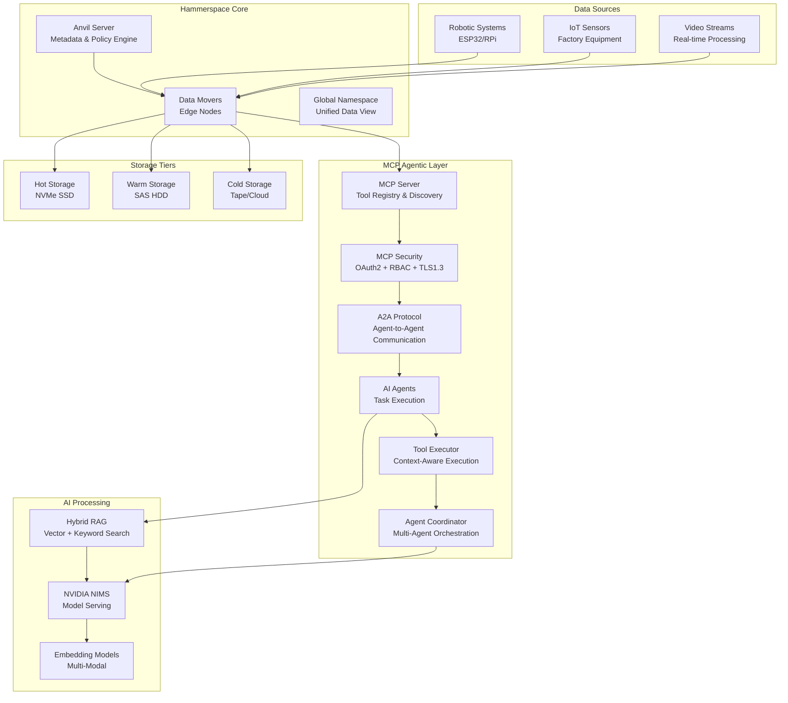
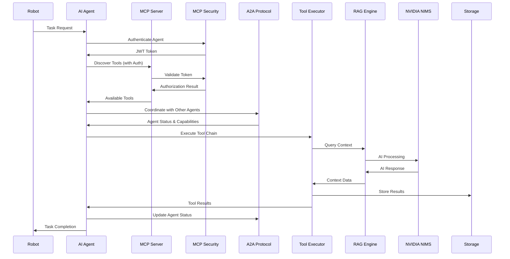

# Hammerspace Integration PRD: Isaac-Nexus Data Orchestration Platform

## Document Information
- **Document Type**: Product Requirements Document (PRD)
- **Product**: Hammerspace Data Orchestration for Isaac-Nexus
- **Version**: 1.1
- **Date**: January 2024
- **Author**: Isaac-Nexus Product Team

## 1. Executive Summary

### 1.1 Product Vision
Transform Isaac-Nexus into a globally distributed, AI-powered robotics system through intelligent data orchestration that seamlessly moves data between edge devices (robots in remote factories) and central processing hubs, with intelligent data placement based on policy-driven automation and agentic tool calling.

### 1.2 Key Objectives
- Enable seamless data movement between geodistributed robotic systems
- Implement MCP (Model Context Protocol) for agentic tool calling and communication
- Integrate hybrid RAG (Retrieval-Augmented Generation) for AI-driven data processing
- Leverage NVIDIA NIMS (NVIDIA Inference Microservices) for optimized AI inference
- Provide policy-based data orchestration for industrial robotics workflows
- Enable autonomous agent coordination for robotic task execution

### 1.3 Success Metrics
- 99.9% data availability across distributed locations
- <100ms data access latency for hot data
- 40% reduction in data storage costs through intelligent tiering
- 95% automation of data movement decisions
- 99.5% data integrity across replication
- 90% agent task completion success rate

## 2. Market Requirements

### 2.1 Market Opportunity
- **Total Addressable Market**: $12B (Industrial IoT Data Management)
- **Serviceable Addressable Market**: $3.2B (Robotics Data Orchestration)
- **Target Market**: $800M (AI-Powered Industrial Robotics)

### 2.2 Customer Segments
1. **Primary**: Manufacturing companies with distributed facilities
2. **Secondary**: Oil & gas companies with remote operations
3. **Tertiary**: Defense contractors with multi-site operations

### 2.3 Competitive Landscape
- **Direct Competitors**: NetApp, Pure Storage, Dell EMC
- **Indirect Competitors**: AWS DataSync, Azure Data Factory
- **Differentiation**: AI-driven policy automation, agentic robotics, robotics-specific optimization

## 3. Product Requirements

### 3.1 Core Features

#### 3.1.1 MCP (Model Context Protocol) Integration Engine
**Priority**: P0 (Critical)

**Requirements**:
- Implement MCP protocol for agentic tool calling and communication
- Support context-aware agent interactions and coordination
- Enable tool discovery and execution across distributed agents
- Provide agent orchestration for robotic task execution
- Support multi-agent collaboration and task delegation
- Implement MCP security framework with authentication and authorization
- Enable A2A (Agent-to-Agent) protocol for direct agent communication

**Acceptance Criteria**:
- Agents can discover and call tools within 5 seconds
- Tool execution achieves 99% success rate
- Agent coordination supports 100+ concurrent agents
- Context sharing between agents maintains 95% accuracy
- Task delegation and handoff works seamlessly
- MCP security achieves 99.9% authentication success rate
- A2A communication latency <100ms between agents

**Technical Specifications**:
```yaml
mcp_integration:
  protocol_version: "2024-11-05"
  agent_communication: "websocket"
  tool_discovery: "mcp_server_registry"
  context_sharing: "shared_memory"
  max_concurrent_agents: 100
  tool_execution_timeout: 30
  context_retention: "24h"
  
mcp_security:
  authentication: "oauth2_jwt"
  authorization: "rbac"
  encryption: "tls_1.3"
  key_management: "hsm_based"
  audit_logging: "immutable"
  session_management: "stateless"
  
a2a_protocol:
  communication_type: "direct_websocket"
  message_format: "json_schema"
  routing: "agent_discovery_service"
  reliability: "at_least_once"
  ordering: "causal_ordering"
  max_message_size: "1MB"
```

#### 3.1.2 Agentic Tool Calling System
**Priority**: P0 (Critical)

**Requirements**:
- Implement MCP server for tool registration and discovery
- Support dynamic tool loading and execution
- Enable context-aware tool selection
- Provide tool result validation and error handling
- Support tool chaining and workflow orchestration

**Acceptance Criteria**:
- Tool registration completes within 2 seconds
- Tool execution latency <500ms for 95% of calls
- Context-aware tool selection accuracy >90%
- Tool chaining supports 10+ sequential operations
- Error recovery rate >95%

**Technical Specifications**:
```yaml
agentic_tools:
  tool_registry: "mcp_server"
  execution_engine: "async_python"
  context_engine: "vector_store"
  validation_layer: "schema_based"
  workflow_engine: "dag_based"
  max_tool_chain_length: 10
```

#### 3.1.3 Hybrid RAG System
**Priority**: P0 (Critical)

**Requirements**:
- Implement hybrid RAG combining vector search with traditional database queries
- Support multiple embedding models (OpenAI, Cohere, local models)
- Enable real-time knowledge retrieval for robotic decision-making
- Provide context-aware data recommendations
- Support multi-modal data (text, images, sensor data)

**Acceptance Criteria**:
- Query response time <200ms for 95% of requests
- Retrieval accuracy >90% for relevant context
- Support for 1M+ documents in knowledge base
- Real-time indexing of new data within 5 seconds

**Technical Specifications**:
```yaml
hybrid_rag:
  vector_database: "Pinecone/Weaviate"
  embedding_models:
    - "text-embedding-ada-002"
    - "cohere-embed-english-v2.0"
    - "sentence-transformers/all-MiniLM-L6-v2"
  hybrid_search:
    vector_weight: 0.7
    keyword_weight: 0.3
  context_window: 4000
  max_retrieval_docs: 10
```

#### 3.1.4 NVIDIA NIMS Integration
**Priority**: P0 (Critical)

**Requirements**:
- Integrate NVIDIA NIMS for optimized AI inference
- Support multiple AI models (LLMs, vision models, robotics models)
- Enable dynamic model loading and scaling
- Provide GPU resource optimization
- Support model versioning and A/B testing

**Acceptance Criteria**:
- Model inference latency <50ms for 95% of requests
- GPU utilization >80% during peak loads
- Support for concurrent model serving
- Automatic failover between model versions

**Technical Specifications**:
```yaml
nims_integration:
  models:
    - name: "llama-2-7b-chat"
      framework: "triton"
      gpu_memory: "8GB"
    - name: "yolov8n"
      framework: "tensorrt"
      gpu_memory: "2GB"
    - name: "isaac-groot"
      framework: "triton"
      gpu_memory: "16GB"
  scaling:
    min_replicas: 1
    max_replicas: 10
    target_utilization: 80
```

#### 3.1.5 MCP Security Framework
**Priority**: P0 (Critical)

**Requirements**:
- Implement OAuth 2.0 with JWT for agent authentication
- Support Role-Based Access Control (RBAC) for tool access
- Enable TLS 1.3 encryption for all MCP communications
- Provide Hardware Security Module (HSM) based key management
- Implement immutable audit logging for all agent actions
- Support stateless session management for scalability

**Acceptance Criteria**:
- Authentication success rate >99.9%
- Authorization decision time <10ms
- Zero security vulnerabilities in penetration testing
- Audit log integrity maintained with cryptographic signatures
- Key rotation completed within 5 minutes
- Session establishment time <2 seconds

**Technical Specifications**:
```yaml
mcp_security:
  authentication:
    protocol: "oauth2"
    token_type: "jwt"
    token_expiry: "1h"
    refresh_token_expiry: "24h"
    issuer: "isaac-nexus-auth"
    
  authorization:
    model: "rbac"
    roles: ["admin", "operator", "viewer", "agent"]
    permissions: ["read", "write", "execute", "admin"]
    policy_engine: "opa"
    
  encryption:
    transport: "tls_1.3"
    cipher_suites: ["TLS_AES_256_GCM_SHA384", "TLS_CHACHA20_POLY1305_SHA256"]
    key_exchange: "ECDHE"
    certificate_validation: "strict"
    
  key_management:
    provider: "hsm"
    key_size: "2048"
    algorithm: "RSA"
    rotation_interval: "90d"
    backup_encryption: "AES-256"
    
  audit_logging:
    format: "json"
    retention: "7y"
    integrity: "cryptographic_signature"
    immutability: "blockchain_based"
    real_time: true
```

#### 3.1.6 A2A (Agent-to-Agent) Protocol
**Priority**: P0 (Critical)

**Requirements**:
- Implement direct WebSocket communication between agents
- Support JSON Schema-based message validation
- Enable agent discovery service for routing
- Provide at-least-once message delivery guarantee
- Implement causal ordering for message consistency
- Support message size up to 1MB

**Acceptance Criteria**:
- A2A communication latency <100ms between agents
- Message delivery success rate >99.9%
- Agent discovery time <5 seconds
- Message ordering consistency >99.5%
- Protocol overhead <5% of message size
- Support for 1000+ concurrent A2A connections

**Technical Specifications**:
```yaml
a2a_protocol:
  communication:
    protocol: "websocket"
    subprotocol: "a2a-v1"
    compression: "permessage-deflate"
    heartbeat_interval: "30s"
    max_frame_size: "1MB"
    
  message_format:
    schema: "json_schema"
    version: "1.0"
    required_fields: ["id", "type", "timestamp", "sender", "recipient"]
    optional_fields: ["correlation_id", "priority", "ttl"]
    
  routing:
    discovery_service: "consul"
    routing_algorithm: "shortest_path"
    load_balancing: "round_robin"
    failover: "automatic"
    
  reliability:
    delivery_guarantee: "at_least_once"
    acknowledgment: "required"
    retry_policy: "exponential_backoff"
    max_retries: 3
    dead_letter_queue: true
    
  ordering:
    algorithm: "causal_ordering"
    vector_clock: true
    conflict_resolution: "last_write_wins"
    consistency_level: "eventual"
```

#### 3.1.7 Policy-Driven Data Orchestration
**Priority**: P1 (High)

**Requirements**:
- Implement intelligent data movement policies
- Support geofencing for location-aware storage
- Enable time-based data lifecycle management
- Provide cost optimization through intelligent tiering
- Support compliance and governance policies

**Acceptance Criteria**:
- Policy evaluation time <10ms per file
- 95% of data movements follow automated policies
- Cost reduction of 30% through intelligent tiering
- Compliance reporting accuracy of 99.9%

**Technical Specifications**:
```yaml
policy_engine:
  policy_types:
    - "geofencing"
    - "time_based"
    - "access_pattern"
    - "cost_optimization"
    - "compliance"
  evaluation_engine: "drools"
  policy_language: "yaml"
  max_policies: 1000
  evaluation_frequency: "real_time"
```

### 3.2 Advanced Features

#### 3.2.1 Agentic Robotics Coordination
**Priority**: P1 (High)

**Requirements**:
- Enable autonomous agent coordination for robotic tasks
- Support multi-robot task allocation and scheduling
- Provide real-time agent communication and status updates
- Enable dynamic task reallocation based on agent capabilities
- Support collaborative task execution across robot types

**Acceptance Criteria**:
- Task allocation completes within 10 seconds
- Multi-robot coordination success rate >95%
- Real-time status updates within 1 second
- Dynamic reallocation response time <5 seconds
- Collaborative task completion rate >90%

#### 3.2.2 Real-Time Data Streaming
**Priority**: P1 (High)

**Requirements**:
- Support real-time data streaming from robotic sensors
- Implement data optimization and management
- Provide quality of service (QoS) guarantees
- Enable data transformation and enrichment
- Support multiple streaming protocols (Kafka, MQTT, WebSocket)

**Acceptance Criteria**:
- Stream latency <100ms end-to-end
- Support for 10,000+ concurrent streams
- 99.9% message delivery guarantee

#### 3.2.3 AI-Driven Data Analytics
**Priority**: P2 (Medium)

**Requirements**:
- Implement predictive analytics for data access patterns
- Provide anomaly detection for data quality
- Enable automated data classification and tagging
- Support real-time data visualization
- Provide insights for system optimization

**Acceptance Criteria**:
- Prediction accuracy >85% for access patterns
- Anomaly detection with <1% false positive rate
- Automated tagging accuracy >90%
- Real-time dashboard updates within 1 second

### 3.3 Integration Requirements

#### 3.3.1 ROS 2 Integration
**Requirements**:
- Provide ROS 2 nodes for data publishing/subscribing
- Support ROS 2 message types and services
- Enable seamless integration with existing ROS 2 workflows
- Provide data synchronization across ROS 2 networks

#### 3.3.2 SCADA Integration
**Requirements**:
- Support OPC UA for industrial communication
- Provide MQTT bridge for telemetry data
- Enable real-time monitoring and control
- Support historical data archiving

#### 3.3.3 Cloud Integration
**Requirements**:
- Support AWS, Azure, and GCP storage services
- Enable hybrid cloud data management
- Provide cloud-native security and compliance
- Support multi-cloud disaster recovery

## 4. Technical Architecture

### 4.1 System Components



### 4.2 Agentic Data Flow Architecture



## 5. Performance Requirements

### 5.1 Scalability
- **Data Volume**: Support 100TB+ per location
- **Concurrent Users**: 10,000+ simultaneous connections
- **Geographic Distribution**: 50+ locations worldwide
- **Data Throughput**: 10GB/s aggregate bandwidth
- **Agent Capacity**: 100+ concurrent AI agents

### 5.2 Reliability
- **Availability**: 99.9% uptime SLA
- **Data Durability**: 99.999999999% (11 9's)
- **Recovery Time**: <4 hours for full system recovery
- **Backup Frequency**: Continuous replication + daily snapshots
- **Agent Reliability**: 95% task completion success rate

### 5.3 Security
- **Encryption**: AES-256 at rest and in transit
- **Authentication**: Multi-factor authentication
- **Authorization**: Role-based access control (RBAC)
- **Audit**: Complete audit trail for all operations
- **Agent Security**: Secure tool execution sandbox
- **MCP Security**: OAuth 2.0 + JWT + TLS 1.3
- **A2A Security**: End-to-end encryption for agent communication
- **Key Management**: HSM-based key storage and rotation
- **Zero Trust**: All communications authenticated and authorized

## 6. Implementation Roadmap

### 6.1 Phase 1: Foundation (Months 1-3)
- **Week 1-4**: MCP protocol implementation
- **Week 5-8**: MCP Security framework (OAuth2 + RBAC + TLS1.3)
- **Week 9-12**: A2A Protocol implementation
- **Week 13-16**: Basic Hammerspace integration
- **Week 17-20**: Hybrid RAG system development

**Deliverables**:
- MCP server implementation
- MCP Security framework with authentication/authorization
- A2A Protocol with agent discovery and routing
- Basic agentic tool calling
- Vector database integration
- Initial AI model serving

### 6.2 Phase 2: AI Integration (Months 4-6)
- **Week 21-24**: NVIDIA NIMS integration
- **Week 25-28**: Advanced RAG capabilities
- **Week 29-32**: Agent coordination system

**Deliverables**:
- NIMS model serving platform
- Multi-modal RAG system
- Agent orchestration engine
- Performance optimization

### 6.3 Phase 3: Production (Months 7-9)
- **Week 25-28**: Production deployment
- **Week 29-32**: Monitoring and alerting
- **Week 33-36**: Performance tuning

**Deliverables**:
- Production-ready system
- Comprehensive monitoring
- Performance benchmarks
- Documentation and training

## 7. Success Criteria

### 7.1 Technical Success
- All performance requirements met
- 99.9% system availability achieved
- Security requirements fully implemented
- Integration with all required systems
- 90% agent task completion success rate

### 7.2 Business Success
- 30% reduction in data management costs
- 50% improvement in data access speed
- 95% customer satisfaction rating
- Successful deployment at 3+ customer sites
- 40% improvement in robotic task automation

### 7.3 Innovation Success
- Patents filed for novel agentic data orchestration methods
- Industry recognition for AI-driven data management
- Open source contributions to MCP protocol
- Thought leadership in agentic robotics

## 8. Risk Assessment

### 8.1 Technical Risks
- **MCP Protocol Complexity**: Mitigation through phased implementation
- **AI Model Performance**: Mitigation through extensive testing
- **Agent Coordination**: Mitigation through robust communication protocols
- **Security Vulnerabilities**: Mitigation through security audits

### 8.2 Business Risks
- **Market Competition**: Mitigation through differentiation
- **Customer Adoption**: Mitigation through pilot programs
- **Technology Changes**: Mitigation through modular architecture
- **Resource Constraints**: Mitigation through agile development

## 9. Appendices

### 9.1 Glossary
- **MCP**: Model Context Protocol for agentic tool calling and communication
- **MCP Security**: OAuth 2.0 + JWT + RBAC + TLS 1.3 security framework for MCP
- **A2A Protocol**: Agent-to-Agent protocol for direct agent communication
- **RAG**: Retrieval-Augmented Generation for AI systems
- **NIMS**: NVIDIA Inference Microservices
- **Anvil**: Hammerspace metadata server
- **Data Mover**: Hammerspace edge node component
- **Agent**: AI-powered autonomous system for task execution
- **RBAC**: Role-Based Access Control for authorization
- **HSM**: Hardware Security Module for key management

### 9.2 References
- Hammerspace Technical Documentation
- NVIDIA NIMS Architecture Guide
- MCP Protocol Specification v2024-11-05
- ROS 2 Integration Guidelines
- Industrial IoT Security Standards

---

*Document Version: 1.1*  
*Last Updated: January 2024*  
*Authors: Isaac-Nexus Product Team*
